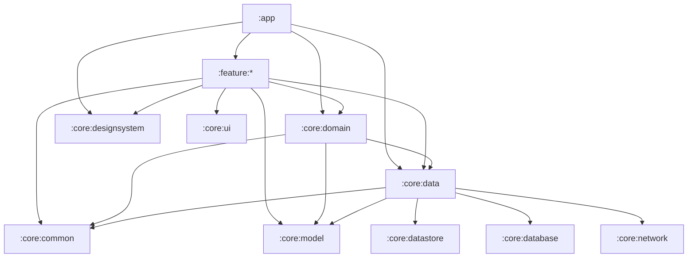

# Stylish - Architecture & Modularization Specification

This document details the modularization structure, Clean Architecture boundaries, and use case placement rules for the **Stylish** Android application.

---

## 1. Modularization Overview

The project follows a **Feature-First + Core Shared Modules** hybrid architecture aligned with modern Android standards (Now in Android pattern).

```
Stylish/
├── app/                              # App entry point, Hilt aggregate, Navigation 3 graph
├── build-logic/                      # Gradle convention plugins (Kotlin DSL)
│
├── core/
│   ├── designsystem/                 # StylishColors, Theme, Typography, Shape, Atomic UI components
│   ├── ui/                           # Reusable cross-feature UI widgets (ProductCard, Banners, etc.)
│   ├── model/                        # Pure Kotlin domain entities (Product, CartItem, User, etc.)
│   ├── domain/                       # Shared cross-feature use cases (AddToCart, ToggleWishlist, etc.)
│   ├── data/                         # Repository implementations, data sync & orchestration
│   ├── network/                      # Network client (Retrofit/Ktor), DTOs, API services, interceptors
│   ├── database/                     # Room DB, Entities, DAOs, Migrations
│   ├── datastore/                    # Jetpack DataStore preferences (tokens, user settings)
│   ├── common/                       # Coroutine dispatchers, Result<T>, common extensions
│   └── testing/                      # Shared test rules, fakes, Turbine utilities
│
└── feature/
    ├── auth/                         # Splash, Onboarding, Login, Register, Forgot Password
    ├── home/                         # Featured deals, carousels, home categories
    ├── category/                     # Product listing by category, filtering & sorting
    ├── product-details/              # Product details, image gallery, size/color selectors, reviews
    ├── cart/                         # Cart items, promo vouchers, checkout breakdown
    ├── checkout/                     # Delivery address, payment selection, order placement
    ├── wishlist/                     # Saved items, quick add-to-cart
    └── profile/                      # User profile, past orders, settings
```

---

## 2. Dependency Rules & Boundaries



### Strict Rules:
1. **Feature isolation:** `:feature:*` modules **never depend on other `:feature:*` modules**.
2. **Inter-feature navigation:** Coordinated at the `:app` level via Navigation 3.
3. **Model purity:** `:core:model` is a pure Kotlin module (`java-library`) with no Android dependencies.

---

## 3. Use Case Placement Strategy

Use Cases encapsulate reusable business logic or coordinate multiple data sources:

| Layer / Scope | Module Location | Examples | Criteria |
| :--- | :--- | :--- | :--- |
| **Shared / Cross-Feature** | **`:core:domain`** | `AddToCartUseCase`, `ToggleWishlistUseCase`, `GetCartBadgeCountUseCase`, `GetActiveUserUseCase` | Logic triggered from 2+ features (e.g. Add-to-Cart from Home, Catalog, Details, and Wishlist). |
| **Feature-Private** | **`:feature:<name>`** | `ValidateShippingAddressUseCase`, `ApplyProductFilterUseCase`, `CalculateHomeFeedSectionsUseCase` | Logic strictly specific to that single feature screen or workflow. |
| **Direct Repository Access** | **ViewModel $\leftarrow$ `:core:data`** | `productRepository.getProduct(id)` | Simple 1:1 pass-through calls with no extra business logic do **not** require a boilerplate Use Case. |
